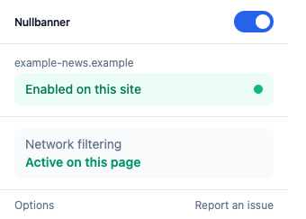
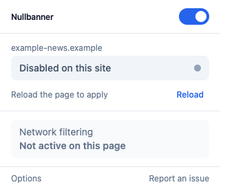
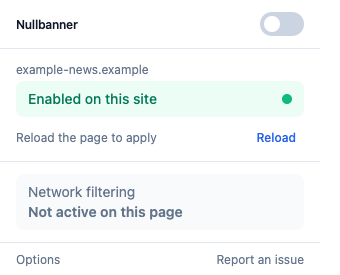
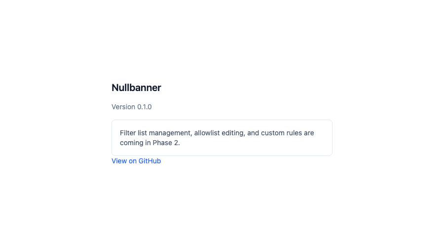

# Nullbanner

**Nullbanner** is a Manifest V3 Chrome extension that blocks ads and trackers
using Chrome's native `declarativeNetRequest` network engine — no injected
runtime blocking logic, no telemetry, no remote code. Open source, GPLv3.

🌐 **[Landing page](https://REPLACE_ME.github.io/nullbanner/)** · 🐛 [Report an issue](https://github.com/REPLACE_ME/nullbanner/issues)

> Not yet published to the Chrome Web Store — install from source (below).

---

## Screenshots

| Popup — protection enabled | Popup — site disabled |
|---|---|
|  |  |

| Popup — global switch off | Options page |
|---|---|
|  |  |

## How to use it

1. **Install it** (see [Installation](#installation) below) and pin it in
   Chrome's toolbar.
2. **Click the Nullbanner icon** on any page — the popup shows the current
   site's hostname and whether protection is active.
3. **Global switch** (top-right of the popup) turns network-rule blocking on
   or off everywhere.
4. **Per-site toggle** disables (or re-enables) protection for just the
   current site — useful if a site breaks with blocking on. After toggling,
   click **Reload** to apply it to the open tab.
5. **Options page** (via the popup's "Options" link) shows the installed
   version; filter-list management and allowlist editing land in Phase 2.

Toggling a site adds or removes a small, deterministic browser-native rule
scoped to that hostname — nothing is ever sent off your device.

## Installation

Nullbanner isn't on the Chrome Web Store yet, so install it from source:

```bash
git clone https://github.com/REPLACE_ME/nullbanner.git
cd nullbanner
pnpm install
pnpm build
```

Then:
1. Open `chrome://extensions`
2. Enable **Developer mode** (top-right toggle)
3. Click **Load unpacked** and select the `dist/` folder
4. Pin Nullbanner via the puzzle-piece icon in Chrome's toolbar

## Development

```bash
pnpm dev         # HMR dev build — reload the unpacked extension after changes
pnpm typecheck
pnpm lint
pnpm test        # unit tests (Vitest)
pnpm build       # production build to dist/
pnpm test:e2e    # Playwright e2e (loads the built dist/ extension)
```

## Current phase: Phase 1 — skeleton + real network blocking

This repo currently implements:
- A working MV3 extension (background service worker, popup, options stub)
- A hand-written, ~10-rule test DNR ruleset (`rulesets/test-ruleset.json`,
  documented rule-by-rule in `rulesets/test-ruleset.md`) used to validate the
  blocking pipeline end-to-end
- Per-site enable/disable via a deterministic dynamic `allowAllRequests` rule
- Global on/off via `updateEnabledRulesets`
- A Preact + Tailwind popup: global switch, per-site toggle with a reload
  hint, a protection-status row, and options/report-issue links

### Deviations from the original brief (and why)
- **No `host_permissions: ["<all_urls>"]` in this phase.** DNR block/allow
  rules don't need host access — only `redirect`/`modifyHeaders` actions do,
  and Phase 1 uses neither. Requesting a broad host permission this early
  would draw unnecessary Chrome Web Store review scrutiny for no benefit
  yet. It will be added in Phase 2 alongside the `scripting` permission,
  when cosmetic content-script injection actually needs page access.
- **No numeric "blocked count" stats.** Accurate counts require
  `chrome.declarativeNetRequest.getMatchedRules`, which is quota-limited to
  roughly 20 calls per 10 minutes (not "a few per minute" as originally
  assumed) and needs the `declarativeNetRequestFeedback` permission — another
  review flag for a feature that isn't load-bearing yet. The popup instead
  shows a protection-status indicator ("Active on this page" / "Not active").
  Per-request counting can be revisited in a later phase if it's worth the
  permission and quota-management cost.
- **Tailwind v3** (with `tailwind.config.ts`), not v4 — v4 removed the JS
  config file in favor of CSS-based `@theme` config, which would have
  changed the file layout described in the brief.
- **No `sinon-chrome` dependency.** It predates Manifest V3's
  `declarativeNetRequest` API and doesn't mock it at all, so it couldn't
  exercise the code under test. Unit tests instead use a small hand-rolled
  `chrome.*` mock (`tests/unit/chrome-mock.ts`) scoped to exactly the APIs
  the background worker calls.

## Roadmap

- **Phase 2** — Cosmetic (CSS) hiding via content scripts, `scripting` +
  `host_permissions` added, options page gains allowlist/filter management
- **Phase 3** — Scriptlet injection, YouTube-specific handling
- **Phase 4** — Real filter list downloading & compilation (EasyList,
  EasyPrivacy, etc.) into DNR rulesets, replacing the hand-written test
  ruleset
- **Phase 5** — Chrome Web Store assets, privacy policy, listing, submission
- **Phase 6** — Firefox/Edge ports

None of the above is implemented yet.

## Project layout

```
src/background/    service worker — network rules, per-site/global toggles
src/popup/         Preact + Tailwind popup UI
src/options/       options page stub
src/content/       cosmetic content script stub (Phase 2)
src/shared/        typed storage + messaging wrappers
rulesets/          hand-written test DNR ruleset + its documentation
tests/unit/        Vitest unit tests (background logic, chrome.* mock)
tests/e2e/         Playwright e2e smoke tests
docs/              GitHub Pages landing page (this repo's marketing site)
```

## Publishing the landing page

The `docs/` folder is a static, dependency-free landing page. To publish it:
1. Push this repo to GitHub
2. Go to **Settings → Pages**
3. Under **Build and deployment**, set **Source** to "Deploy from a branch",
   branch `main`, folder `/docs`
4. Save — the page goes live at `https://<you>.github.io/<repo>/`

## License

GPLv3 — see [LICENSE](./LICENSE).
